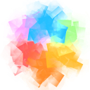

  

  A simple 2D graphics library for C++.

<!-- zip -r9 libxd.zip libxd/ -x "*.git*" */lib/**\* -->
<!-- cpack -G ZIP -->

# Links

* [Documentation](https://bernhardfritz.github.io/libxd/)

# Changelog

## [0.1.1](https://github.com/bernhardfritz/libxd/releases/tag/0.1.1)

### Added

* Quadtree example

### Changed

* the way memory is allocated for the settings stack

### Fixed

* point() not being affected by strokeWeight()

## [0.1.0](https://github.com/bernhardfritz/libxd/releases/tag/0.1.0)

### Added

* namespace xd.
* a small program that can be used to embed text-based resource files into headers.
* install targets.
* package targets.
* releases for Linux, macOS and Windows.

### Changed

* shader version to GLSL 3.30.
* include directory folder structure.
* the way how shaders are loaded.
* the libxd logo.
* the documentation.

## 0.0.3

### Added

* the possibility to define key event callbacks using the functions `keyPressed()` and `keyReleased()`.
* keyboard interaction example.

### Changed

* the documentation.
* some cmake build scripts.

## 0.0.2

### Added

* the possibility to define mouse event callbacks using the functions `mouseMoved()`, `mousePressed()`, `mouseReleased()` and `mouseWheel()`.
* mouse interaction example.
* Google Analytics.

### Changed

* the location of `include/stb_image.h` to `lib/stb/stb_image.h`.
* the documentation.
* some cmake build scripts.

### Fixed

* the lib folder being wrongly identified as a first party source folder by github's linguist.

## 0.0.1

This is the start of libxd as a remote repository. Prior to publishing libxd to github goes about 2 months of local development. These are rudimentary changelogs from the time before github:

### Added

* the functions `setup()`, `draw()` and `destroy()` using forward declaration.
* global variables `width`, `height` to retrieve the current width and height.
* shape functions: `ellipse()`, `line()`, `point()`, `rect()`, `triangle()`.
* vertex, geometry and fragment shaders which contain e.g. the logic that allows to draw outlined shapes in a single render cycle.
* drawing style functions: `background()`, `clear()`, `ellipseMode()`, `fill()`, `noFill()`, `noStroke()`, `rectMode()`, `stroke()`, `strokeWeight()`.
* support of alpha channel for functions that deal with colors.
* transformation functions: `applyMatrix()`, `resetMatrix()`, `rotate()`, `scale()`, `translate()`.
* constants: `HALF_PI`, `PI`, `QUARTER_PI`, `TWO_PI`.
* the functions `push()` and `pop()` which allow the current drawing style settings and matrix transformations to be temporarily saved on a stack.
* the possibility to directly modify window pixels using the global variable `pixels`.
* support for image loading.
* the possibility to directly modify image pixels using the member variable `Image::pixels`.
* convenience functions like: `millis()`, `random()`, `randomSeed()`.
* functions that allow to alter the control flow: `loop()`, `noLoop()`.
* a function `redraw()` that ought to be used in conjunction with `noLoop`.
* libraries: `glad`, `glfw`, `glm`, `stb_image`.
* a docsify documentation.
* cmake build scripts.
* fireworks example.
