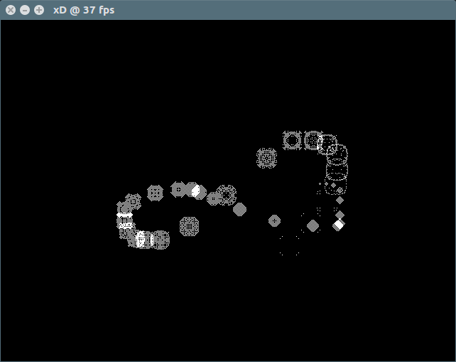

# 2D Water

Implementation of [2d water algorithm](https://web.archive.org/web/20160418004149/http://freespace.virgin.net/hugo.elias/graphics/x_water.htm)

[Source code](https://github.com/bernhardfritz/libxd/tree/master/examples/2dwater)

