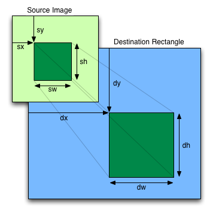

# Image

## Image

#### Description

Datatype for storing images. libxd can display `.jpg`, `.png`, `.tga`, `.bmp`, `.psd`, `.gif`, `.hdr`, and `.pic` images. Images can be loaded with the [loadImage()](image.md#loadImage) function. The `Image` class contains fields for the width and height of the image, as well as an array called pixels[] that contains the values for every pixel in the image.

#### Fields

`width` float: the width of the image

`height` float: the height of the image

`pixels` vec4[]: an array of color values of all the pixels of this image

---

## image()

#### Description

Draw an image.

This function can be used with different numbers of parameters.

The basic version of `image()` uses 5 parameters and behaves similarly to [rect()](shape.md#rect).

The more advanced version of `image()` uses 9 parameters and should be used whenever you only want to display a subimage instead of the whole image. When using this function, think of the terms "destination rectangle" (which corresponds to "dx", "dy", etc.) and "source image" (which corresponds to "sx", "sy", etc.) and remember this illustration:



_The illustration above has been shamelessly repurposed from the [p5.js image reference](https://p5js.org/reference/#/p5/image)._

#### Syntax

```C++
image(img, x, y, width, height)
```

```C++
image(img, dx, dy, dWidth, dHeight, sx, sy, sWidth, sHeight)
```

#### Parameters

`img` Image*: the image to display

`x` float: the x-coordinate of the top-left corner of the image

`y` float: the y-coordinate of the top-left corner of the image

`width` float: the width to draw the image

`height` float: the height to draw the image

`dx` float: the x-coordinate of the destination rectangle in which to draw the source image

`dy` float: the y-coordinate of the destination rectangle in which to draw the source image

`dWidth` float: the width of the destination rectangle

`dHeight` float: the height of the destination rectangle

`sx` float: the x-coordinate of the subsection of the source image to draw into the destination rectangle

`sy` float: the y-coordinate of the subsection of the source image to draw into the destination rectangle

`sWidth` float: the width of the subsection of the source image to draw into the destination rectangle

`sHeight` float: the height of the subsection of the source image to draw into the destination rectangle

---

## imageMode()

#### Description

Modifies the location from which images are drawn by changing the way in which parameters given to [image()](image.md#image) are interpreted.

The default mode is `imageMode(CORNER)`, which interprets the second and third parameters of [image()](image.md#image) as the upper-left corner of the image, while the fourth and fifth parameters are its width and height.

`imageMode(CORNERS)` interprets the second and third parameters of [image()](image.md#image) as the location of one corner, and the fourth and fifth parameters as the opposite corner.

`imageMode(CENTER)` interprets the second and third parameters of [image()](image.md#image) as the image's center point, while the fourth and fifth parameters are its width and height.

`imageMode(RADIUS)` also uses the second and third parameters of [image()](image.md#image) as the image's center point, but uses the fourth and fifth parameters to specify half of the image's width and height.

The parameter must be written in ALL CAPS because C++ is a case-sensitive language.

#### Syntax

```C++
imageMode(mode)
```

#### Parameters

`mode` DrawMode: either CORNER, CORNERS, CENTER, or RADIUS

---

## loadImage()

#### Description

Loads an image into a variable of type [Image*](image.md#Image). The types of images that can be loaded include `.jpg`, `.png`, `.tga`, `.bmp`, `.psd`, `.gif`, `.hdr`, and `.pic` images. For images to load correctly, you can either specify an absolute path or a path relative to sketch's executable.

In most cases, load all images in setup() to preload them at the start of the program. Loading images inside draw() will reduce the speed of a program. Images cannot be loaded outside setup() unless they're inside a function that's called after setup() has already run.

If the file is not available or an error occurs, `nullptr` will be returned and an error message will be printed to the console. The error message does not halt the program, however the `nullptr` value may cause a segmentation fault if your code does not check whether the value returned is `nullptr`.

#### Syntax

```C++
loadImage(filename)
```

#### Parameters

`filename` string: name of the file to load

#### Returns

Image*: a pointer to the Image object

---

## noTint()

#### Description

Removes the current fill value for displaying images and reverts to displaying images with their original hues.

#### Syntax

```C++
noTint()
```

---

## tint()

#### Description

Sets the fill value for displaying images.

#### Syntax

```C++
tint(color)
```

#### Parameters

`color` vec4: the tint color
