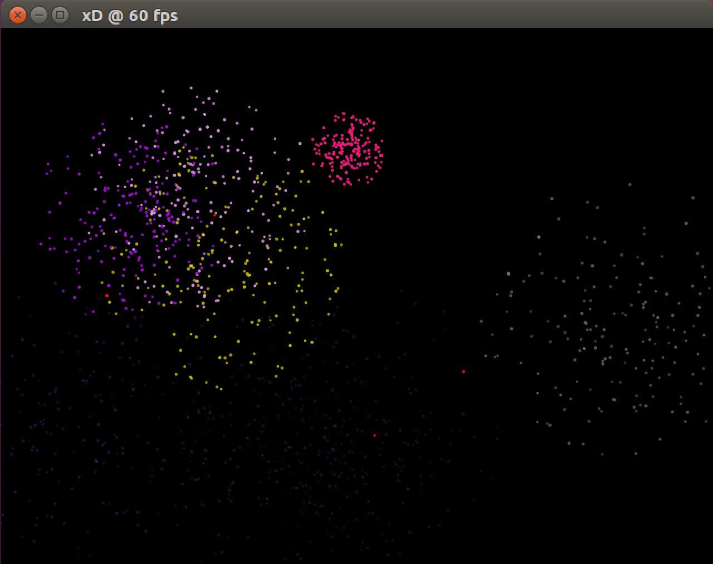
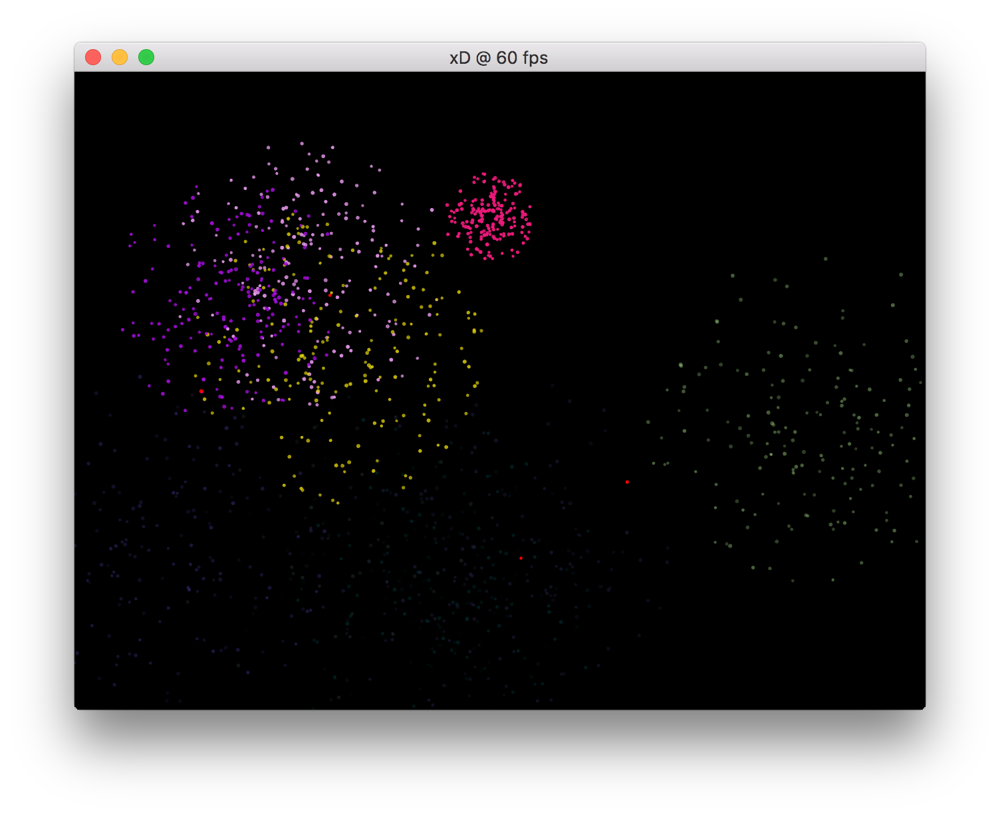
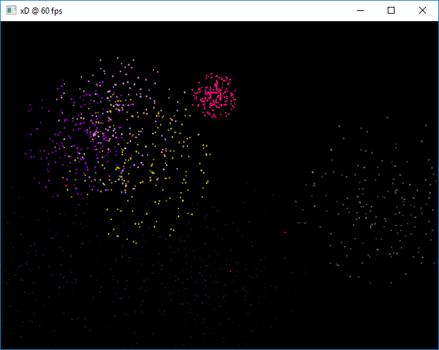

# Running the examples

Assuming you have successfully compiled libxd following the guidelines described [here](compile.md), running the fireworks example, results in a new window being opened that should look similar to one of those depicted in the screenshots below.

## Linux

#### Running the fireworks example

```bash
./examples/fireworks/sketch
```



---

## macOS

#### Running the fireworks example

```bash
./examples/fireworks/sketch
```



---

## Windows

#### Running the fireworks example

```cmd
.\examples\fireworks\sketch.exe
```

