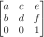

# Transform

## applyMatrix()

#### Description

Multiplies the current matrix by the one specified through the parameters. This is a powerful operation that can perform the equivalent of translate, scale, shear and rotate all at once. You can learn more about transformation matrices on [Wikipedia](https://en.wikipedia.org/wiki/Transformation_matrix).

The naming of the arguments corresponds to a transformation matrix of the form:



#### Syntax

```C++
applyMatrix(a, b, c, d, e, f);
```

#### Parameters

`a` float: numbers which define the 3x3 matrix to be multiplied

`b` float: numbers which define the 3x3 matrix to be multiplied

`c` float: numbers which define the 3x3 matrix to be multiplied

`d` float: numbers which define the 3x3 matrix to be multiplied

`e` float: numbers which define the 3x3 matrix to be multiplied

`f` float: numbers which define the 3x3 matrix to be multiplied

---

## resetMatrix()

#### Description

Replaces the current matrix with the identity matrix.

#### Syntax

```C++
resetMatrix()
```

---

## rotate()

#### Description

Rotates a shape the amount specified by the angle parameter. Angles have to be entered in radians.

Objects are always rotated around their relative position to the origin and positive numbers rotate objects in a clockwise direction. Transformations apply to everything that happens after and subsequent calls to the function accumulates the effect. For example, calling `rotate(HALF_PI)` and then `rotate(HALF_PI)` is the same as `rotate(PI)`. All tranformations are reset when [draw()](structure.md#draw) begins again.

Technically, `rotate()` multiplies the current transformation matrix by a rotation matrix. This function can be further controlled by the [push()](structure.md#push) and [pop()](structure.md#pop).

#### Syntax

```C++
rotate(angle)
```

#### Parameters

`angle` float: the angle of rotation, specified in radians

---

## scale()

#### Description

Increases or decreases the size of a shape by expanding and contracting vertices. Objects always scale from their relative origin to the coordinate system. Scale values are specified as decimal percentages. For example, the function call `scale(2.0f)` increases the dimension of a shape by 200%.

Transformations apply to everything that happens after and subsequent calls to the function multiply the effect. For example, calling `scale(2.0f)` and then `scale(1.5f)` is the same as `scale(3.0f)`. If `scale()` is called within [draw()](structure.md#draw), the transformation is reset when the loop begins again.

#### Syntax

```C++
scale(x, y)
```

#### Parameters

`x` float: percent to scale the object in the x-axis

`y` float: percent to scale the object in the y-axis

---

## translate()

#### Description

Specifies an amount to displace objects within the display window. The x parameter specifies left/right translation, the y parameter specifies up/down translation.

Transformations are cumulative and apply to everything that happens after and subsequent calls to the function accumulates the effect. For example, calling `translate(50.0f, 0.0f)` and then `translate(20.0f, 0.0f)` is the same as `translate(70.0f, 0.0f)`. If `translate()` is called within [draw()](structure.md#draw), the transformation is reset when the loop begins again. This function can be further controlled by using [push()](structure.md#push) and [pop()](structure.md#pop).

#### Syntax

```C++
translate(x, y)
```

#### Parameters

`x` float: left/right translation

`y` float: up/down translation